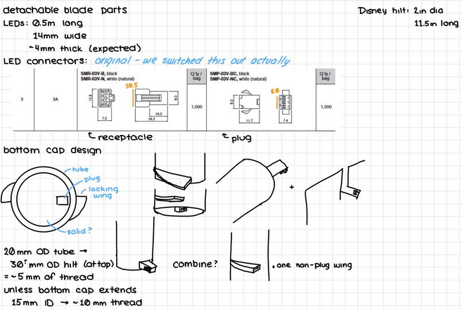
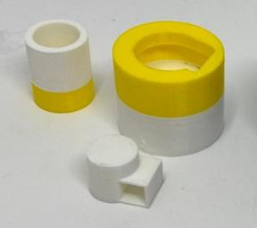
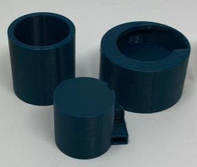
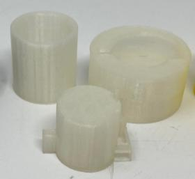
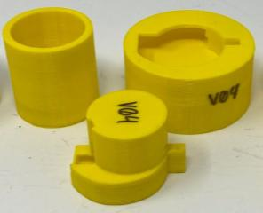
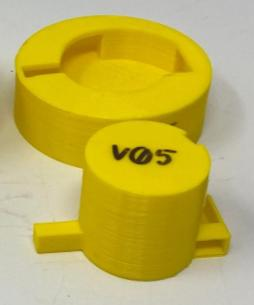
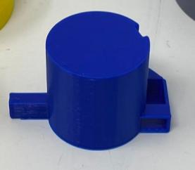
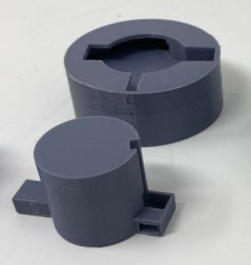
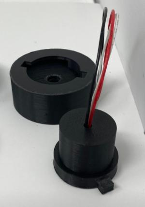

The detaching mechanism for the detachable blade went through several iterations to get to the final version. Versions 1-2 were products of the second sprint and versions 3-7 were products of the third sprint. 

[Back to Sprint 2](../Sprints/#sprint-2-mech)

[Back to Sprint 3](../Sprints/#sprint-3-mech)

<iframe width="560" height="315" src="https://youtu.be/tNJzzJCSO8g" title="YouTube video player" frameborder="0" allow="accelerometer; autoplay; clipboard-write; encrypted-media; gyroscope; picture-in-picture" allowfullscreen></iframe>

#### Initial Design

  

#### Version 1

We began by creating a proof of concept with a small blade and placeholder to for plug on the side of the endcap.

  

[Back to top](#top)

#### Version 2

For our next iteration of the detachable mechanism we increased the size of the blade tubing and added a wire channel to the plug holder. 

  

[Back to top](#top)

#### Version 3

For version 3, we tested using the socket instead of the plug on the blade side adn added space for the connector on the hilt side. 

  

[Back to top](#top)

#### Version 4

For version 4, added an auxiliary stabilizer across from the plug to increase stability and increased clearances for plug and socket.

  

[Back to top](#top)

#### Version 5

For version 5, we reduced teh height of the stabilizer and added a thread to the hilt side to attach to the rest of the hilt.

  

[Back to top](#top)

#### Version 5.5

For version 5.5, we reduced the height of spline behind plug passthrough on endcap.

  

[Back to top](#top)

#### Version 6

For version 6, we tested adding a third stabilizer and modifying placement and clearance for connectors. We also modified the thread to match the rest of the hilt.

  

[Back to top](#top)

#### Version 7

For version 7, the final version, we moved the connectors to center of endcap instead of side and changed to first plug in wires manually, then twist the blade into place.

  

[Back to top](#top)
