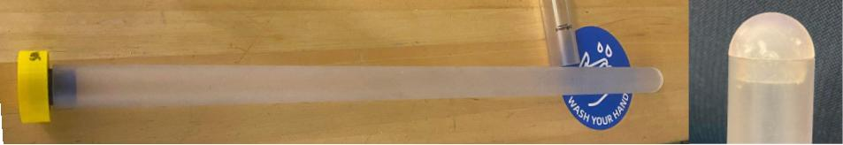

## Sprint 1
In Sprint 1, our team decided we wanted to create a replica lightsaber. We decided our mvp would be a lightsaber with a detachable blade with a reach goal of recreating Disney's new extendable blade lightsaber. 

[Presentation](https://docs.google.com/presentation/d/1-5Kee44TzqyZskYLsyKVEHtzWcdqXS3h8iD9GProHQo/edit?usp=sharing)

#### Mechanical
To do this, our mechanical team split between developing the detachable blade and creating a proof of concept of the extendable blade. On the detachable side of things, we focused on the electronics packaging within the hilt with a focus on making it secure and compact enough that the hilt can comfortably fit in someone's hand.

**ADD PICTURE OF INITIAL LAYOUT FROM SPRINT 1/CAD MODEL**

For the extendable blade, we investigated how we could make this work, basing it off of Disney's new lightsaber. We landed on a tape measure mechanism where the tape measure would be spool in the hilt and attached to the LEDs, so that they can be pulled out together. The mvp for this extendable blade was decided to be a single tape measure with a LED strip extending together.

  

#### Electrical
For electrical, we put the FeatherWing onto the Feather M4 Express and then connected the battery, speaker, button, and LEDs. 

  

#### Software
The board we got runs CircuitPython natively, so the software is done directly on the board. The base code for the lightsaber already exists ([Source](https://learn.adafruit.com/hallowing-lightsaber/program-with-circuitpython)), so we started with getting the base code running on our board, before making tweaks. This initial code powered the blade on and played humming sounds based on accelerometer values.

## Sprint 2
In Sprint 2, we wanted to see how far along we could get with the extendable lightsaber, before deciding whether we should focus on only the detachable lightsaber or both the detachable and extendable ones. We ultimately decided to continue pursuing both, leading us to purchase another Adafruit Propmaker kit. Luckily, we found an LED strip to use for this blade, so we wouldn't have to purchase another which would have put us way over budget.

#### Mechanical
For the detachable blade, this sprint we modified the electronics packaging, so that the hilt of the lightsaber could be more compact and more closely resemble Disney's lightsaber dimensions. Additionally, we began working on the detaching mechanism of the blade. 

  

For the extendable blade, we reverse engineered a motorized tape measure. We found that the motor was sufficient for our needs, so we switched the battery out for a **?** volt one. We then connected the tape measure and LEDs, although the diameter of the LED spool was too small, leading to problems when retracting the blade. 

**ADD PHOTO OF INITIAL EXTENDABLE BLADE**

We also looked into different thicknesses of polycarbonate and polypropylene film to thermoform into the tape spring shape as a possible alternative to the tape measure. This would allow the LED light to diffuse through the plastic. We ended up getting a range of films to test which would be best.

#### Electrical
For electrical, we put together the second set of electronics for the second blade. Additionally, we added a second button and a switch.

  

#### Software
For software, we added the ability to switch between blade colors based on button input. There are four different blade colors with corresponding audio files that play music when the blade is extended. We had originally planned to add a fifth color with music, but the Featherwing's memory was too small to hold it. Finally, we separated the detachable and extendable code.

[Github Repo](https://github.com/nabihestefan/Lightsaber)

## Sprint 3
In Sprint 3, we finished up both the extendable and detachable blades. Additionally, early on, we ordered the polycarbonate tubing for the detachable blade and the films to test thermoforming for the extendable blade. This order caused us to go over budget because the shipping for the tubing was $37. 

[Presentation](https://docs.google.com/presentation/d/1FsrQfatEuBN9W9HeRLlkH6D4EyJWSfqdYsHG7buiOm8/edit?usp=sharing)
 
#### Mechanical
This sprint, we finalized the detaching mechanism of the detachable blade and designed the casing of the hilt. 

  

**ADD PHOTO OF CASING PRINTS/CAD DESIGN - DETACHABLE**

Additionally, we used an emery cloth to diffuse the blade and printed a resin cap for the tubing.

  

For the extendable blade, we fixed the LED spool, so that the LEDs wrap around the spool without loosening when retracting, and we printed the casing for the hilt. Additionally, we successfully thermoformed the film, creating the proof of concept for the clear blade, but we did not have the time or material to implement it. 

**ADD PHOTO OF CASING PRINTS/CAD DESIGN - EXTENDABLE**

#### Electrical
For electrical, there were problems LED wires twisting too much in the extendable blade when the LED spool rotated to extend. This was solved by adding longer wires connecting to the LEDs, giving the wires more room to twist without breaking. 

#### Software
We finished the software for the blade last sprint, so we focused on documentation for this sprint.