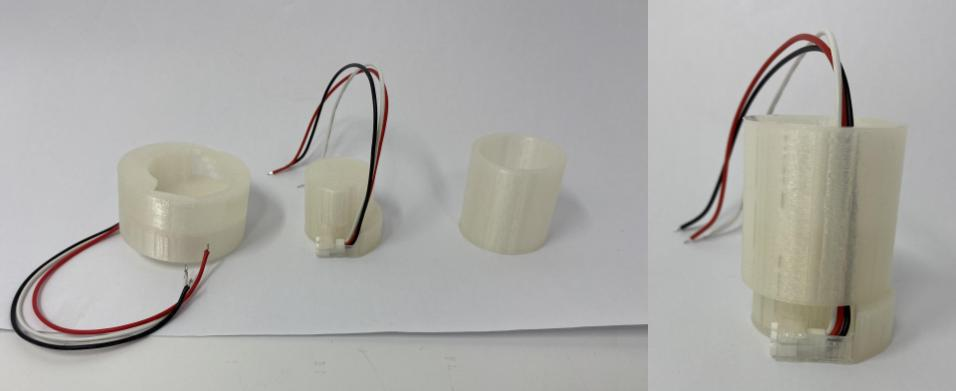

## Sprint 1
In Sprint 1, our team decided we wanted to create a replica lightsaber. We decided our mvp would be a lightsaber with a detachable blade with a reach goal of recreating Disney's new extendable blade lightsaber. 

[Presentation](https://docs.google.com/presentation/d/1-5Kee44TzqyZskYLsyKVEHtzWcdqXS3h8iD9GProHQo/edit?usp=sharing)

#### Mechanical
To do this, our mechanical team split between developing the detachable blade and creating a proof of concept of the extendable blade. On the detachable side of things, we focused on the electronics packaging within the hilt with a focus on making it secure and compact enough that the hilt can comfortably fit in someone's hand.

**ADD PICTURE OF INITIAL LAYOUT FROM SPRINT 1/CAD MODEL**

For the extendable blade, we investigated how we could make this work, basing it off of Disney's new lightsaber. We landed on a tape measure mechanism where the tape measure would be spool in the hilt and attached to the LEDs, so that they can be pulled out together. The mvp for this extendable blade was decided to be a single tape measure with a LED strip extending together.

  

#### Electrical
For electrical, we soldered the Prop-Maker FeatherWing onto the Feather M4 Express and then connected the battery, speaker, button, and LEDs. 

  

#### Software
The board we got runs CircuitPython, so the software is done directly on the board. The base code for the lightsaber already exists ([Source](https://learn.adafruit.com/hallowing-lightsaber/program-with-circuitpython)), so we started with geting the base code running on our board, before making tweaks.

## Sprint 2
In Sprint 2, we wanted to see how far along we could get with the extendable lightsaber, before deciding whether we should focus on only the detachable lightsaber or both the detachable and extendable ones. We ultimately decided to continue pursuing both, leading us to purchase another Adafruit Propmaker kit. Luckily, we found an LED strip to use for this blade, so we wouldn't have to purchase another which would have put us way over budget.

#### Mechanical
For the detachable blade, this sprint we modified the electronics packaging, so that the hilt of the lightsaber could be more compact and more closly resemble Disney's lightsaber dimensions. Additionally, we began working on the detaching mechanism of the blade. 

  

  

## Sprint 3

[Presentation](https://docs.google.com/presentation/d/1FsrQfatEuBN9W9HeRLlkH6D4EyJWSfqdYsHG7buiOm8/edit?usp=sharing)