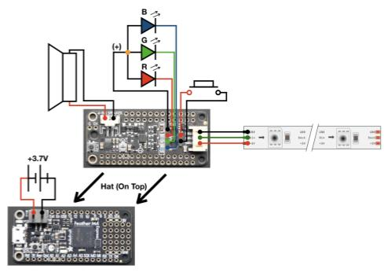
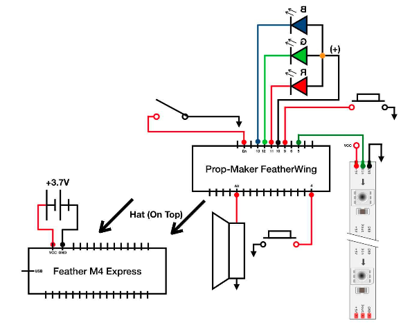

## Mechanical
The mechanical design was broken into two parts for the detachable and extendable blade.

#### Detachable

#### Extendable

## Electrical
We developed a system that allowed the user to change the color of the Lightsaber and made the Lightsaber react to movement. We needed the system to be compact such that it could be contained in the hilt of the Lightsaber, which needs to fit comfortably in someone's hand.

We worked with a Feather M4 which runs CircuitPython natively on the board, allowing us to use the UF2 bootloader to update the code on the board. Then, we added the FeatherWing board on top of the Feather M4. We choose this board as it came with a NeoPixel port for LEDs, a triple-axis accelerometer, and a Class D audio amplifier, key requirements for a Lightsaber. 

For the first iteration, we wanted to create a system that would meet the MVP electrical requirements: turn a strip of LEDs on and off while producing sounds based on button input. We achieved this by connecting a 4 Ohm, 3 Watt speaker to the audio connector on the FeatherWing, connecting the 0.5 meter NeoPixel LEDs to the JST port on the FeatherWing, and connecting a push button to the switch and ground pins. Additionally, we connected a 3.7 volt Lipo battery to the Feather M4's Lipoly JST jack to power the boards. This set up is shown in the circuit diagram below. 

  

**WHAT ARE THE R,G,B DIODES FOR?**

We found that this system did meet the MVP electrical requirements, so for our second and final iteration, we added a button which would allow us to switch between Lightsaber blade colors. This set up is shown in the circuit diagram below. 

**IS THE SWITCH BEING USED? IF SO WHAT FOR?**

  

Unfortunately, since we chose to create two different Lightsabers, we could not spare more money for the electrical system at this time. However, in future iterations, we would like to add sensors in the blade of the Lightsaber. Specifically, we would add one in the tip of the blade to allow us to create blade drag effect as seen in The Force Awakens. However, sensors along the blade would allow us flash the blade white in the location it was hit instead of flashing the whole blade white. 

## Software
