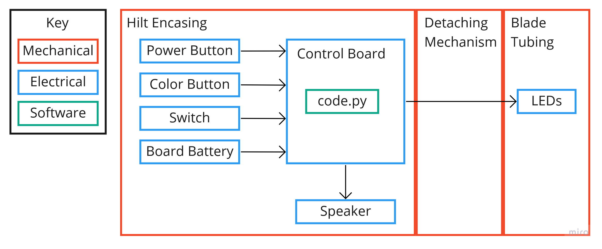
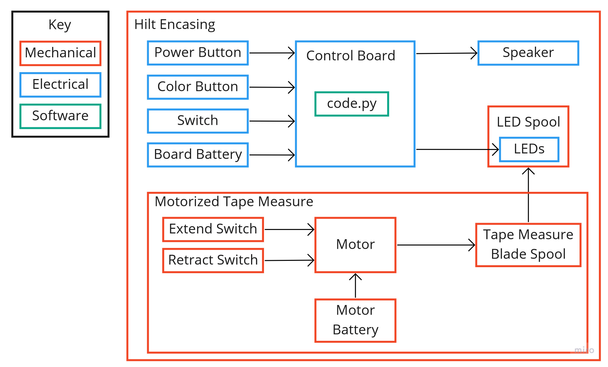
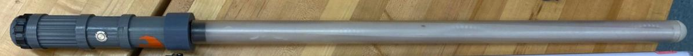
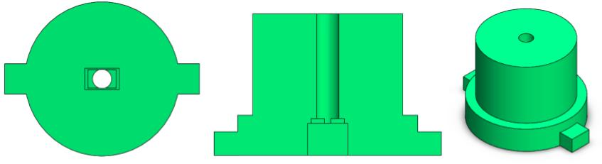
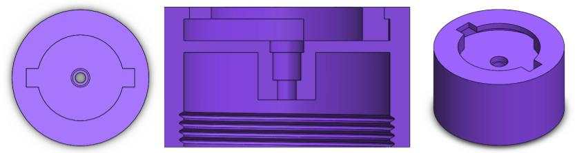
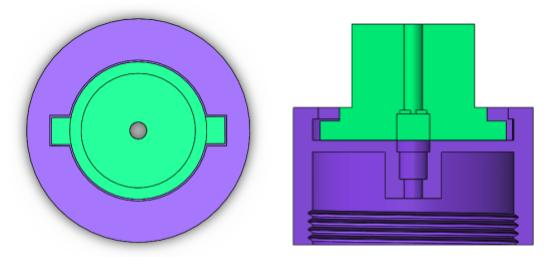
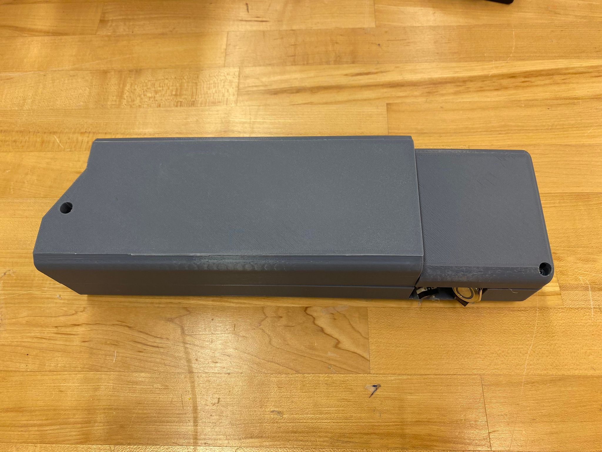
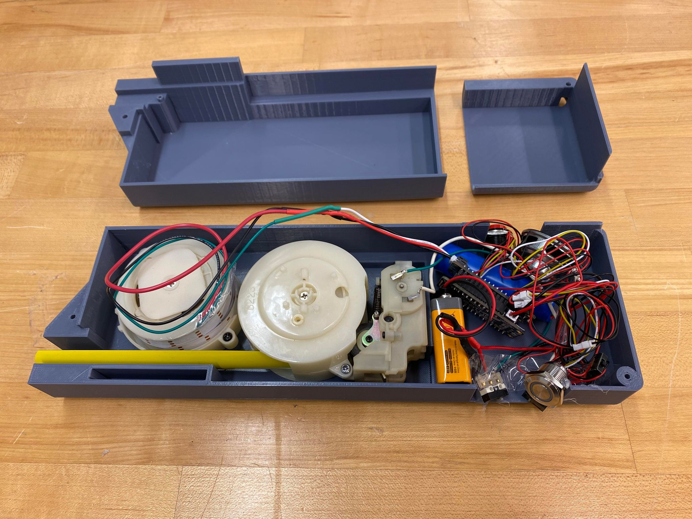

While the electrical and software systems remain the same for both blades, the mechanical systems differ. The system diagrams along with the final lightsabers are shown below. 

[Mechanical](#mechanical-subsystem) 
[Electrical](#electrical-subsystem) 
[Software](#software-subsystem)

## Detachable

  

  

[Video of Detachable Blade](https://www.youtube.com/embed/RMrMl14pZ-I)

## Extendable

  

  

[Video of Extendable Blade](https://youtu.be/GjQWpX-BY98)

## Mechanical
The mechanical design was broken into two parts for the detachable and extendable blade.

#### Detachable

The detachable lightsaber has two main components: the hilt which holds the electronics and the blade which houses the LED strip.

  

The blade is made of a piece of diffused polycarbonate tubing with two endcaps holding a strip of LEDs in the center. The diffusion was done by rubbing the polycarbonate tubing with an emery cloth and placing 0.002 inch thick polycarbonate film on the inside of the tube. The upper endcap covers the top of the blade and is connected to the top of the LED strip, so the LEDs hang through the blade tubing. The lower endcap, shown in green in the CAD models below, also holds a connector that interfaces with a matching connector on the hilt. Together, the lower endcap and matching connector, shown in purple in the CAD models below, act as the deaching mechanism to remove the blade from the hilt, allowing the LED strip to be connected to the hilt electronics when the blade is attached.

  

  

  

  

 
The hilt is made of several cylinders which thread together and each hold various electrical components such as the battery, speaker, and control board. The components are secured with hidden supports inside the hilt pieces. The speaker is housed in the very bottom of the hilt, and the battery is hosed in the component above it. This allows for easy access to the Lipo battery for recharging. Then, the buttons and switch are housed in the third component, and the control board is housed in the top component. The control board is revealed here in our version of kyber crystal reveal that some lightsabers have. This top component is then connected to the hilt connector of the detaching mechanism.

 

  

#### Extendable

We developed a mechanical system for the extendable lightsaber that has three main components: the LED strip spool which connects to the electronics, the tape measure spool which connects to the motor fiction wheel, and the motor friction wheel driving the tape measure wheel.

  

The ends of the LED strip and the tape measure are connected and secured together via hot glue. There are three primary electronic switches: 1 moves the tape measure blade forward, 1 moves the tape measure blade backwards and 1 turns on/off the LED strip and sound effects. By pressing both the blade forward and blade on buttons, the lightsaber blade is extended and activated. By pressing both the blade backward and blade off buttons, the blade is retracted and turned off. 

The motor friction wheel drives the tape measure blade forward or backward by applying a torque to the outside of the coiled tape measure blade.

Both the LED strip spool and the tape measure blade spool are installed with clock springs that provide a constant counterclockwise torque acting to pull the LED strip and tape measure blade back into the hilt. Consequently, these clock springs provide tension that keeps the blade straight.

The blade angle tensioner, a metal rod that can rotate with nominal friction, is present in the blade opening. It presses the LED strip flat against the tape measure blade, ensuring that the force applied by the LED strip to the end of tape measure blade (at the connection) is as close to parallel to the tape measure blade as possible. This force needs to be parallel, or else the tension from the LED strip will pull the tape measure blade upwards and crumple the tape measure blade. 

  

The casing of the extendable blade hilt is very boxy and bulky due to housing the LED spool and the tape measure blade spool and the electronics are stuffed in the bottom to save room. In future iterations, we want focus on making the hilt more compact and cylindrical and having a secure electronics layout within the hilt.

  

## Electrical
We developed an electrical system that allowed the user to change the color of the lightsaber and made the lightsaber react to movement. We needed the system to be compact such that it could be contained in the hilt of the lightsaber, which needs to fit comfortably in someone's hand.

We worked with a Feather M4 which runs CircuitPython natively on the board, allowing us to use the UF2 bootloader to update the code on the board. The FeatherWing board sits on top of the Feather M4. We choose this board as it came with a NeoPixel port for LEDs, a triple-axis accelerometer, and a Class D audio amplifier, key requirements for a lightsaber.

The system features a 4 Ohm, 3 Watt speaker, a 0.5 meter NeoPixel LEDs, two push button, and a switch which are all connected to the FeatherWing board. One push button is used to turn the lightsaber on, and the other is used to change the color of the lightsaber. There is a 3.7 volt Lipo battery connected Feather M4 board to power the system. This set up is shown in the circuit diagram below.

  

When powering on or changing colors, the system uses the amplifier and speaker to play music. Otherwise, lightsaber noises are played based on accelerometer input. The switch is used to disconnect the battery from the system to prevent the battery from being drained when not in use. 

Unfortunately, since we chose to create two different lightsabers, we could not spare more money for the electrical system at this time. However, in future iterations, we would like to add sensors in the blade of the lightsaber. Specifically, we would add one in the tip of the blade to allow us to create blade drag effect as seen in [The Force Awakens](https://youtu.be/FJTz-ahXyyI?t=247) and a material cutting effect as seen in [The Phantom Menace](https://youtu.be/K48M2S7bkSA?t=1). However, sensors along the blade would allow us flash the blade white in the location it was hit instead of flashing the whole blade white.

## Software

We developed a software system that turns the Lightsaber on and off, changes the color of the blade, and plays music and lightsaber sounds. The code can be found in our Github repository and is separated by detachable and extendable for ease of use.

[Lightsaber Repo](https://github.com/nabihestefan/Lightsaber)

The software is written in python and is based of off existing lightsaber code ([Source](https://learn.adafruit.com/hallowing-lightsaber/program-with-circuitpython)). This initial code powers the blade on and plays humming sounds based on accelerometer values. Additional code was added to switch between blade colors based on button input. There are four different blade colors with corresponding audio files that play music when the blade is extended. Originally, there was a fifth color with music, but memory limitations with the board prevented it from being added to the lightsaber. 

In future iterations, we would like to modify the code to create unstable blade effects, as seen with Kylo Ren's blade in The Force Awakens. 