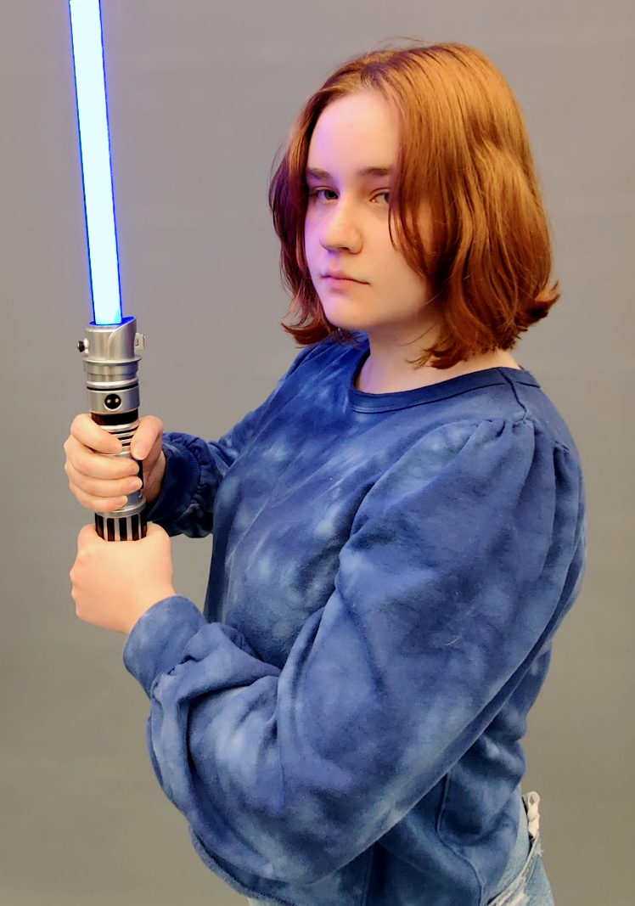
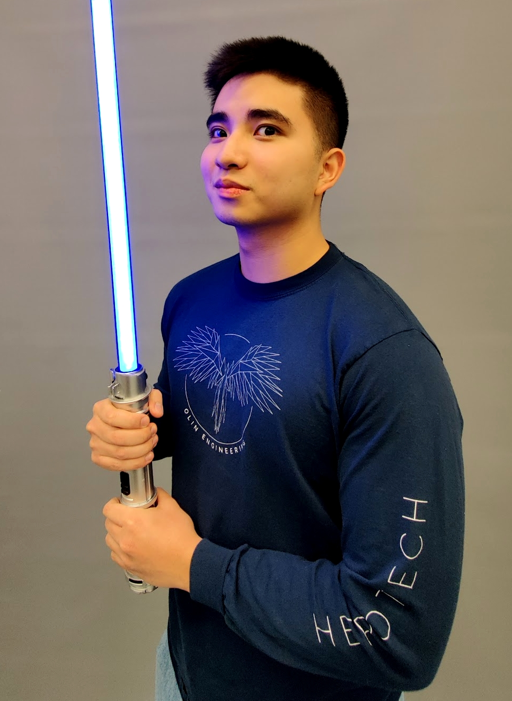
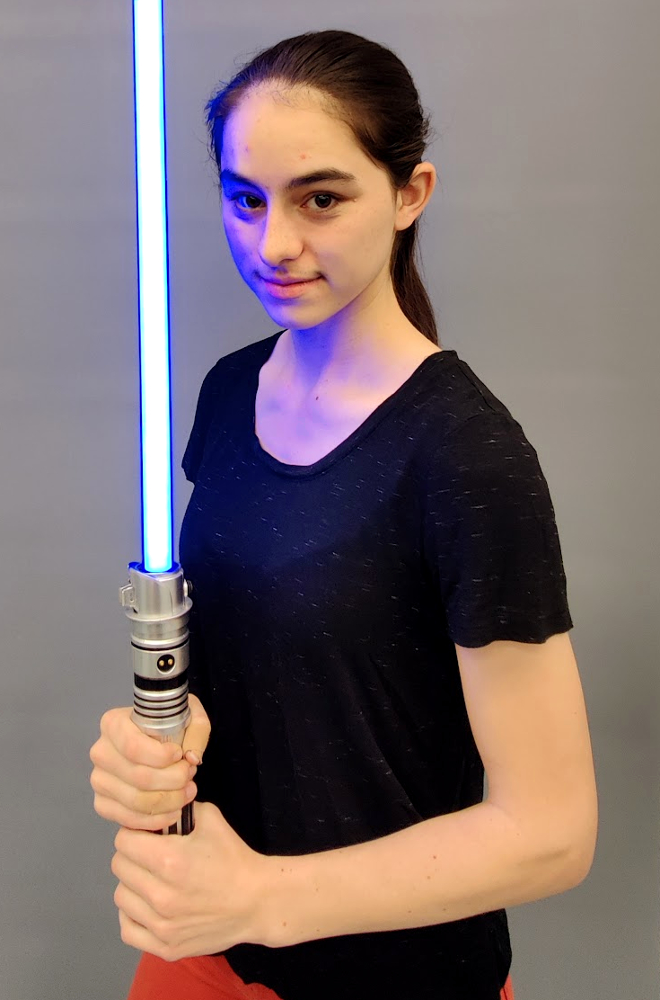
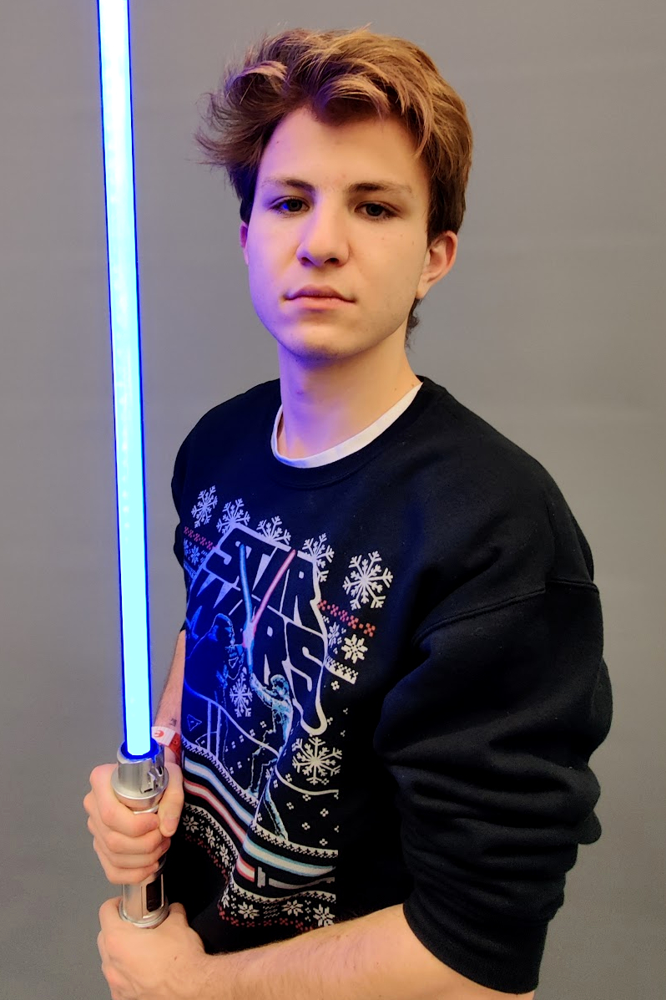
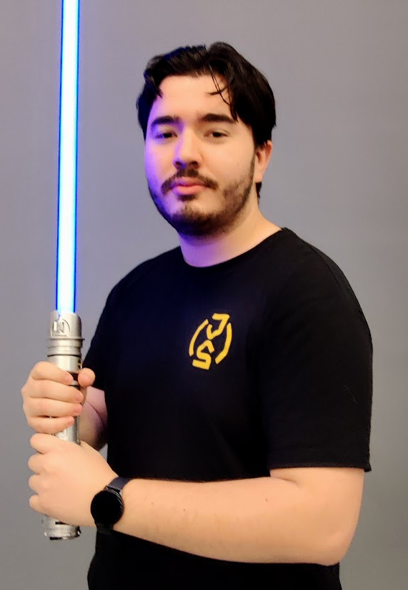

---
#
# By default, content added below the "---" mark will appear in the home page
# between the top bar and the list of recent posts.
# To change the home page layout, edit the _layouts/home.html file.
# See: https://jekyllrb.com/docs/themes/#overriding-theme-defaults
#
layout: home
---

# Our Project

Welcome, we are the lightsaber team of the Fall 2021 Principles of Integrated Engineering Class. For our final project, we  decided to create our very own lightsabers! You can find more about our engineering or design via these links, or read on below to learn more about the overall goals we had and what we did!

[Engineering - Systems](./Systems/)

[Design Reviews - Sprints](./Sprints)

  

## Project Goals
For our project, we planned to build two replica lightsabers. On the mechanical side, we want to make a separable hilt and blade which can be disconnected and reconnected easily. The hilt itself needs to be at least large enough to hold our electronics, including a speaker, controller, and enough batteries to power the saber. The blade was expected to be sturdy enough to be swung around as if dueling. For our second blade, we wanted to make an extendable blade controlled by a button on the hilt. Other lesser goals included making a modular hilt, making the lightsaber properly balanced, and possibly adding a kyber crystal reveal in the hilt.

On the electrical/software side we wanted both lightsabers to possess visual and sound effects, as well as power on and off in a similar way to Disney's lightsabers. For effects, we wanted to have multiple characters available to the user via a button which would change the lightsaber's color and play a theme song. In idle, the lightsaber also emulates hits and swinging noises via the speaker.

For this project we hope that we are able to get as close to a traditional replica saber as possible. Our main inspiration coming from the Disney Imagineers most recent [lightsaber](https://youtu.be/ggWBEj8ppgM).

## Final Deliverable

In the end, we were able to deliver on our project goals and create both lightsabers. Some improvements we would like to make in future iterations include:
  - Create a smaller more accurate hilt for the extendable version
  - Add an outer blade encasing to the extendable lightsaber
  - Create the hilts out of properly machine metals instead of 3D printed material
  - Further develop the diffusion done on our blades
  - Develop our own bi-stable roll of heat-treated plastic to use instead of the tape measure
  - Create a blade drag, material cutting, and unstable blade effect as seen in the Star Wars movies

Demos of both lightsabers can be found below:

<!--  -->

##### Detachable
<iframe width="560" height="315" src="https://www.youtube.com/embed/RMrMl14pZ-I" title="YouTube video player" frameborder="0" allow="accelerometer; autoplay; clipboard-write; encrypted-media; gyroscope; picture-in-picture" allowfullscreen></iframe>

##### Extendable
<iframe width="560" height="315" src="https://youtu.be/GjQWpX-BY98" title="YouTube video player" frameborder="0" allow="accelerometer; autoplay; clipboard-write; encrypted-media; gyroscope; picture-in-picture" allowfullscreen></iframe>

## Meet the Team

#### Abby Omer

  
   
   
   
   
   
  Lorem ipsum dolor sit amet, consectetur adipiscing elit, sed do eiusmod tempor incididunt ut labore et dolore magna aliqua. Ut enim ad minim veniam, quis nostrud exercitation ullamco laboris nisi ut aliquip ex ea commodo consequat.

 
 
 
 

#### Jacob Uy

  
   
   
   
   
   
  Lorem ipsum dolor sit amet, consectetur adipiscing elit, sed do eiusmod tempor incididunt ut labore et dolore magna aliqua. Ut enim ad minim veniam, quis nostrud exercitation ullamco laboris nisi ut aliquip ex ea commodo consequat.

 
 
 

#### Laurel Rodriguez Mitton

  
   
   
   
   
   
  Lorem ipsum dolor sit amet, consectetur adipiscing elit, sed do eiusmod tempor incididunt ut labore et dolore magna aliqua. Ut enim ad minim veniam, quis nostrud exercitation ullamco laboris nisi ut aliquip ex ea commodo consequat.

 
 
 
 

#### Nabih Estefan

  
   
   
   
   
   
  Lorem ipsum dolor sit amet, consectetur adipiscing elit, sed do eiusmod tempor incididunt ut labore et dolore magna aliqua. Ut enim ad minim veniam, quis nostrud exercitation ullamco laboris nisi ut aliquip ex ea commodo consequat.

 
 
 
 

#### Oscar G. De La Garza

  
   
   
   
   
   
  Lorem ipsum dolor sit amet, consectetur adipiscing elit, sed do eiusmod tempor incididunt ut labore et dolore magna aliqua. Ut enim ad minim veniam, quis nostrud exercitation ullamco laboris nisi ut aliquip ex ea commodo consequat.

 
 
 
 
